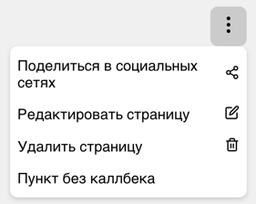

### Тестовое задание "Dropdown Menu"

1. Для запуска проекта требуется установить зависимости

   `yarn` или `npm install`

2. Далее запустить сам проект

   `yarn start` или `npm run start`

3. Проект будет запущен в development mode по адресу [http://localhost:3000](http://localhost:3000).
